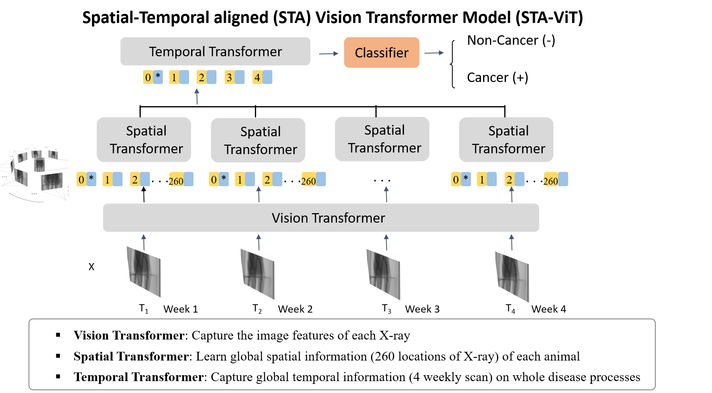
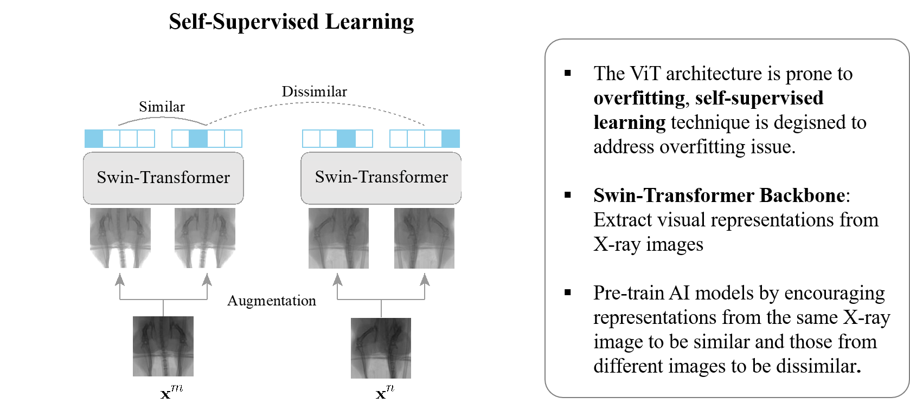

# ST-ViT: Spatial-Temporal Vision Transformer for Breast Cancer Bone Metastasis Early diagnosis 

## Model Overview




This repository provides the official implementation of our proposed  Spatial-Temporal Vision Transformer (ST-ViT), developed for diagnosing Breast Cancer Bone Metastasis (BCBM) using Rotation-X-Ray imagery. The MMST-ViT consists of a Multi-Modal Transformer, a Spatial Transformer, and a Temporal Transformer. The  Spatial-Temporal aligned Transformer leverages Rotation-X-Ray images and context data to effectively capture detailed diagnostic information. The Spatial Transformer learns high-resolution spatial dependencies within Rotation-X-Ray images, enhancing precise identification of metastatic lesions. The Temporal Transformer captures sequential imaging features, significantly improving the model's ability to generalize and reducing overfitting by utilizing spatial-temporal alignment (STA).

## Dataset

This work utilizes the  ***BoneMet*** dataset for early BCBM diagnosis. The BoneMet dataset comprises two primary modalities, i.e., Rotation-X-Ray Imagery and Clinical Data, detailed as follows:

- **Rotation-X-Ray Imagery**: This modality includes 2D X-ray images that have been spatially and temporally aligned to form cohesive Rotation-X-Ray sequences. The images enable the effective exploitation of spatial-temporal features critical for accurate BCBM diagnosis.

- **MiceMediRec**: Accompanying clinical data include patient-specific labels (tumor/nontumor) relevant to BCBM, enhancing diagnostic precision when integrated with Rotation-X-Ray imagery. 

The BoneMet dataset is carefully curated and annotated, ensuring high-quality benchmarks for training and validating deep learning models, particularly those designed to leverage spatial-temporal dependencies for medical imaging tasks.


Now, our BoneMet dataset is available at [HuggingFace Datasets](https://huggingface.co/datasets/BoneMet/BoneMet/tree/main/Imagery_Dataset/1.%20Rotation-X-ray).

    
## Requirements

Our model is based on the following libraries:

- torch == 1.13.0
- torchvision == 0.14.0
- timm == 0.5.4
- numpy == 1.24.4
- pandas == 2.0.3
- h5py == 3.9.0
- einops == 0.6.1
- Pillow == 10.0.0
- argparse == 1.4.0
- tqdm == 4.65.0
- scikit-learn == 1.3.0
- tensorboard == 2.13.0

You can use the following instructions to install all the requirements:

```python
# install requirements
pip install -r requirements.txt
```


## Pre-training




The above figure illustrates the architecture of our proposed multi-modal self-supervised pre-training.

 To pre-train ST-ViT, please run the following command:

```python
# pre-train
python main_pretrain_st_vit.py
```


## Fine-tuning

To fine-tune ST-ViT for BCBM early diagnosis, use the following command:

```python
# fine-tune with spatial-temporal alignment
main_finetune_with_STA.py

# fine-tune without spatial-temporal alignment
main_finetune_without_STA.py
```

## License

This repository is under the CC-BY-NC 4.0 license. Please refer to [LICENSE](https://github.com/Tiankuo528/blob/main/LICENSE) for details.

## Acknowledgment

This repository is based on the official implementation of [Swin](https://github.com/microsoft/Swin-Transformer) and [MAE](https://github.com/facebookresearch/mae). We thank the authors for releasing the code.

## Citation

```
@inproceedings{chubonemet,
  title={BoneMet: An Open Large-Scale Multi-Modal Murine Dataset for Breast Tumor Bone Metastasis Diagnosis and Prognosis},
  author={Chu, Tiankuo and Lin, Fudong and Wang, Shubo and Jiang, Jason and Gong, Wiley Jia-Wei and Yuan, Xu and Wang, Liyun},
  booktitle={The Thirteenth International Conference on Learning Representations}
}
```
